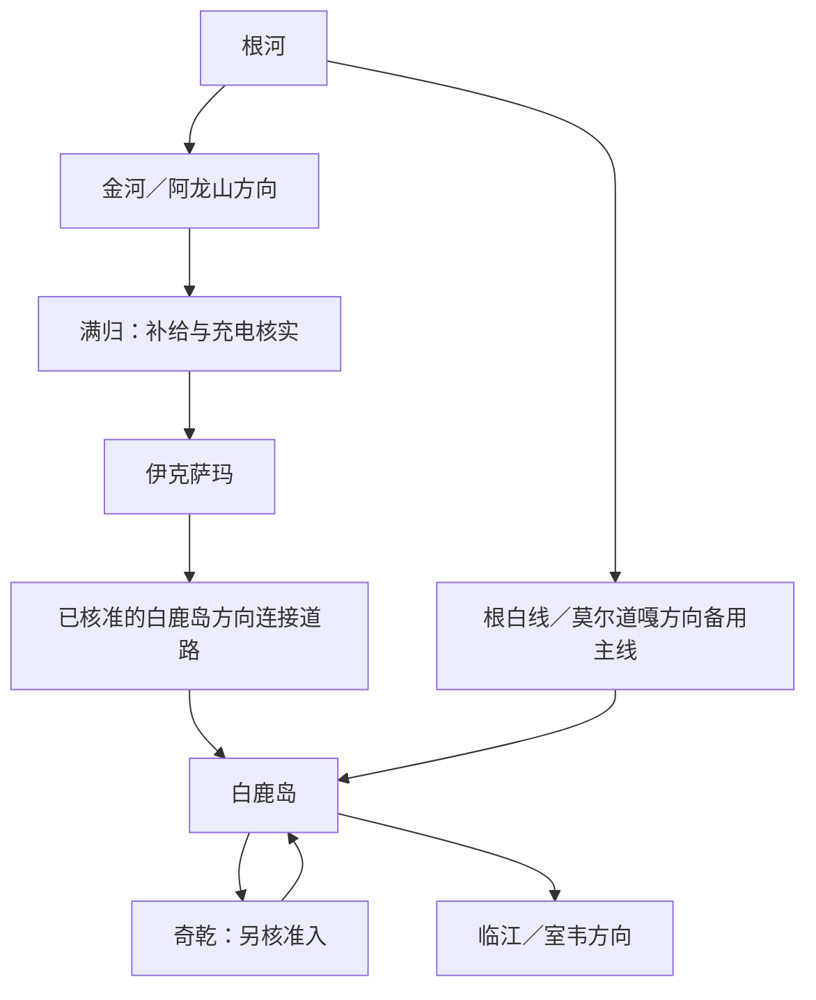

# 满归—伊克萨玛—白鹿岛—奇乾穿越调查

> 历史调查底稿。当前路线已采用V0.4条件方案；新增白鹿岛酒店不可携宠、跨夜补能未闭环等关键结论见《出行落实清单》，不能只读本稿判定可发车。

核验日期：2026-09-20。适用对象：夫妻二人、两只成年边牧、Model Y L，9月25日—10月7日北京往返。此文是调查结果，不是获准通行证明、充电实时状态或已发布路书。未电话联系有关单位，也未进行实地勘察。

## 结论

穿越应保留为可认真规划的候选，不能再只用旧劝返游记否定。已找到历史官方绕行路线和2026年夏季双向实驾证据。证据最完整的走法是满归→伊克萨玛→白鹿岛方向公共连接道路→白鹿岛→奇乾，而不是默认从伊克萨玛抄一条直接进奇乾的林道。

现有证据支持“这条走廊实际存在、近期有人驾车走通”，但不足以承诺9月底车辆与两犬可通行、无需登记或报备。奇乾不应成为穿越到白鹿岛的必经点；奇乾临时不能进而主穿越仍开放时，直接去白鹿岛和临江，不需要因此返回满归。

## 路线关系

以下为候选走廊关系，不是比例地图、路口坐标或逐转向导航。

- 根河市交通局2024年公告给出的道路走廊为：根河→X325根白公路→X316北岸至荒火地公路→X304满归至奇乾公路→满归。它证明该连接走廊曾正式作为绕行通道使用，不代表整条X304任意支路或2026年秋季均开放。[S1]
- 本次最具体的2026年实驾作者在岔路口没有走直去奇乾的支路，而是先经白鹿岛再去奇乾。[S2]
- 因而若采用证据更完整的走法，去奇乾后向临江南下，仍会有白鹿岛—奇乾方向的部分往返。不能宣传成全程零回头路。
- S302金河—莫尔道嘎封闭段不直接影响上面两条主走法。只有穿越失败、从满归退到金河想横切莫尔道嘎时，才需要改为退到根河。[S9]

## 证据与反证

| 来源与时间 | 实际支持的事实 | 不能推出什么 |
|---|---|---|
| S1 根河交通局，2024-08-23 | 将X325→X316→X304列为根满公路施工期间绕行线路 | 不能把2024临时安排当2026全时段通行许可 |
| S2 旅游博主“渺渺kan世界”，2026-08-08当日实驾 | 满归→伊克萨玛→白鹿岛→奇乾，约180多公里；作者报告路面沉降、长段无信号；当天未遇报备检查 | 不是9月底通行公告；未证明直插奇乾支路开放；未证明Model Y、两犬或充电条件 |
| S3 汽车之家暑假实驾，2026-08-27发布 | 恩和→室韦→临江→太平→白鹿岛→伊克萨玛→满归，单日总行程350公里；文中明确选择白鹿岛向东去满归，有沿途照片 | 350公里不是满归—白鹿岛的里程；反向走通不等于未来日期放行保证；没报告手续不等于不需要 |
| S4 新浪承载微博，2025-07-22 | 游客在奇乾方向检查点被劝返，自述尝试“消失的331”去满归 | 未给准确轨迹，不能证明他走的就是S1/S3连接走廊；不能推导整个伊克萨玛穿越禁行 |
| S5 2025-07-09商家路线文 | 描述满归经伊克萨玛沿激流河至白鹿岛方向，冻胀起伏、纵裂及信号问题 | 商家评价不是路况验收；关于必需报备或全线无桩的旧说法不能直接沿用 |

综合判断：历史道路公告与2026年两份独立实驾，比单篇2025劝返记录更能支持连接走廊的现实可行性。不同路口、年份和目的地被统称为“满归—奇乾穿越”，是网上结论冲突的重要可能原因；未取得被劝返车辆轨迹，不能断言只是走错路。

## 里程、时间、车辆

- 满归经伊克萨玛、白鹿岛到奇乾：S2记录约180多公里，非本次实时导航测距。
- 白鹿岛到奇乾：S2记录40多公里；此前旧游记有约50公里说法。暂按约40—50公里单程量级理解，最终以实际停车点与获准路线核准，不承诺精确数。
- S2约10时出发、18时到奇乾，包含拍照、停留和天气影响，是约8小时旅行用时，不能当8小时纯驾驶；也不能把180公里按高速速度排为两小时。
- 初步建议留完整白天：满归过夜补能，次日穿越与游览，夜宿奇乾或白鹿岛需要另核两犬和季节营业。若只能回莫尔道嘎住宿，须重新计算里程与时间，不硬塞临江。
- 近期记录和商家文支持连接走廊以铺装路为主，但有冻胀沉降与裂缝。不能因“柏油路”承诺Model Y底盘无风险；不纳入1409高地、山顶便道或不明林道。遇冰雪、塌方、积水或禁行，按实际停止或改线。
- 骑行导航是部分游记描述的找路方法，不是汽车通行依据，本方案不采纳。使用获准公路的离线轨迹和路口信息，不绕卡、不闯禁行标志。

## 电车：查到了一个强证据，尚未形成完整补能闭环

### 满归主站候选

**蔚来超充站｜根河满归聚仙阁宾馆**：蔚来认证官方账号2026-06-28公布上线，编号NO.3259。可以确认“官方宣布建成上线”，不等于本次出行日设备完好、空闲、有几把枪或对本车开放。[S6]

执行前仍要在运营端核对站点地址、充电接口、对非蔚来车型开放情况、枪数/功率、营业、最近成功充电记录及车辆占位。不能把单站多枪当作独立备站。

### 满归备用线索

**满归伊克萨玛大酒店，爱民街8号，0470-5378688**：携程设施栏标有充电桩/充电车位，但未核清功率、交直流及外来车辆能否使用。酒店政策明确不可携带宠物，因此不能直接作为你们的住宿推荐；仅可询问是否允许不入住使用停车场充电。[S7]

### 白鹿岛和奇乾

检索中有AI聚合文章声称白鹿岛有12把快充，但未找到独立运营商证据，故不入已落实站表。奇乾接入电网的新闻也不等于有对外汽车充电设施。当前不能写“确定无桩”，也不能写“可依赖补电”。

必须按最后实际充电成功的站点→穿越→奇乾往返及住宿→下一处已核可靠站点计算用电，同时保留返回已知可用站的退路。过夜暖风和两犬车内空调需求计入；本轮不虚构抵达电量或98%出发必够的结论。

## 9月底的真实通行变量

国家林草局2026-03-17转载当年防灭火命令：大兴安岭林区防火期为4月1日至10月31日，地方可动态调整；高火险时段可依法封山封林。不能把内蒙古一般秋防日期直接当作这里完整规则，也不能把“防火期”理解为整季不准自驾。[S8]

S2今年8月报告无需报备，与2025商家文的需报备说法不同。当前没有查到足以覆盖9月底本线路的明确通行手续公告，因此不写“必须住奇乾才给进”，也不写“全线免手续”。道路通行、公园游览、奇乾进村以及携犬准入要分别确认。

目前最有效的官方核验入口：**满归镇政府公开工作电话0470-5374908**，2026-07-24机关简介列示，工作时段9:00—12:00、14:30—17:30（节假日除外）。这是镇政府联系入口，不是已经确认的景区售票热线；请其转接对应道路、林区卡口或旅游管理单位。[S10]

建议按完整线路询问，不只问“能不能去伊克萨玛”：

> 我们拟于9月29日前后，两人一辆纯电城市SUV，带两只成年边牧，从满归经伊克萨玛，沿X304/X316对应连接走廊到白鹿岛，再去奇乾。普通游客车辆能否全程通行？应走哪个路口、避开哪条受限支路？当天通行时段、需要的登记/防火手续和奇乾准入分别是什么？携犬随车穿行及允许下车区域如何规定？是否有近期施工或临时封闭？请提供管理该路段的单位和公开联系电话。

网上能核实到道路存在与夏季实驾；缺少的最后一环是出行日主管方答复与充电实时核验。此文不伪称已打通电话或办妥手续。

## 两犬与野生动物

没有获得伊克萨玛、奇乾住宿对两只成年边牧的明确接待确认。民宿自养狗、平台笼统标注宠物友好，都不能替代确认犬型、数量和入住规则。本次不新增狗证件任务。

额尔古纳市文旅体局2026年7月安全提醒涉及奇乾、恩和哈达和林区道路棕熊出没；遵守不围观、不投喂、不下车接近，食物收好。两犬只在获准且安全的区域短停牵绳，不在林道任意放跑或露营。[S11] S2中有关准备投喂的做法明确不采纳。

## 对行程选择的建议

1. **保留满归—伊克萨玛—白鹿岛作为优先核实的穿越候选**，不因S302封闭删除它。
2. **奇乾作为白鹿岛方向的支线**，优先采用2026实驾支持的经白鹿岛进入方式，不依赖未核准的伊克萨玛直达奇乾支路。
3. 在根河决定是否向满归继续前进前，核实穿越与补能；若不满足，改根白线，避免到了满归才发现要长距离退回。
4. 若主穿越可行但奇乾不接待，仅删奇乾；若白鹿岛住宿不接待两犬，另算当日可到达的合法住宿，不能默认睡林道解决。
5. 不再断言该线必需14—15天。能否塞入13天需在道路、补能、住宿锚点确定后重算全程；本调查不自动发布或改写已上线网站。

## 参考来源

- S1 [根河市交通局2024-08-23绕行公告](https://www.genhe.gov.cn/OpennessContent/show/444918.html)：官方历史道路编号证据，网页直读不稳定，全文搜索索引可读。
- S2 [渺渺kan世界，2026-08-08满归至奇乾实驾](https://www.sina.cn/news/detail/5329750119416376.html)：第一人称当日记录，全文已读；只采纳道路、里程和当日观察，不采纳投喂或骑行导航建议。
- S3 [汽车之家2026暑假青岛自驾（三），8月27日发布](https://club.autohome.com.cn/bbs/thread/06e533a723d52827/115955006-1.html)：明确白鹿岛向东经伊克萨玛到满归，图片及路线段可核，非实时路况。
- S4 [2025-07-22奇乾方向被劝返记录](https://www.sina.cn/news/detail/5191320890509456.html)：第一人称反证，无完整轨迹，不能推断所有连接路都禁行。
- S5 [2025-07-09商家路线说明](https://www.sohu.com/a/912054726_417080)：辅助连接走廊、路面和信号描述，旧手续及无桩结论不照搬。
- S6 [蔚来官方2026-06-28站点上线公告](https://www.sina.cn/news/detail/5314707192810113.html)：满归聚仙阁宾馆超充站上线，非当下设备状态。
- S7 [携程：满归伊克萨玛大酒店设施、电话和宠物政策](https://hotels.ctrip.com/hotels/107203256.html)：充电设施仅候选线索，政策不接待宠物。
- S8 [国家林草局：2026年内蒙古防灭火命令](https://www.forestry.gov.cn/lyj/1/dfdt/20260317/663339.html)：当年防火期和临时管控依据，非某条线路封闭公告。
- S9 [根河交通局：2026年S302封闭与绕行](https://www.genhe.gov.cn/Elderly/News/show/1421773.html)：只影响特定道路和退路。
- S10 [满归镇政府机关简介，2026-07-24](https://www.genhe.gov.cn/OpennessContent/show/142292.html)：公开联系入口和办公时间。
- S11 [额尔古纳文旅体局棕熊避险提醒转载，2026-07-07](https://www.ctdsb.net/c1716_202607/2791574.html)：只提取车辆避险、禁止投喂与保持距离等原则。

## 研究方法与边界

按深度搜索调研技能分三层检索：先查道路/通行/官方资料，再深入道路编号、近期实驾、充电与林区规则，最后用反向实驾、官方上线公告及2026防火命令交叉核验。未将标题自动带“2026”的旧游记当新记录；未将AI聚合文章、商业团可走、工程完工等同于普通游客自行通行许可。没有未经用户授权联系他人、报备个人信息或预订。
